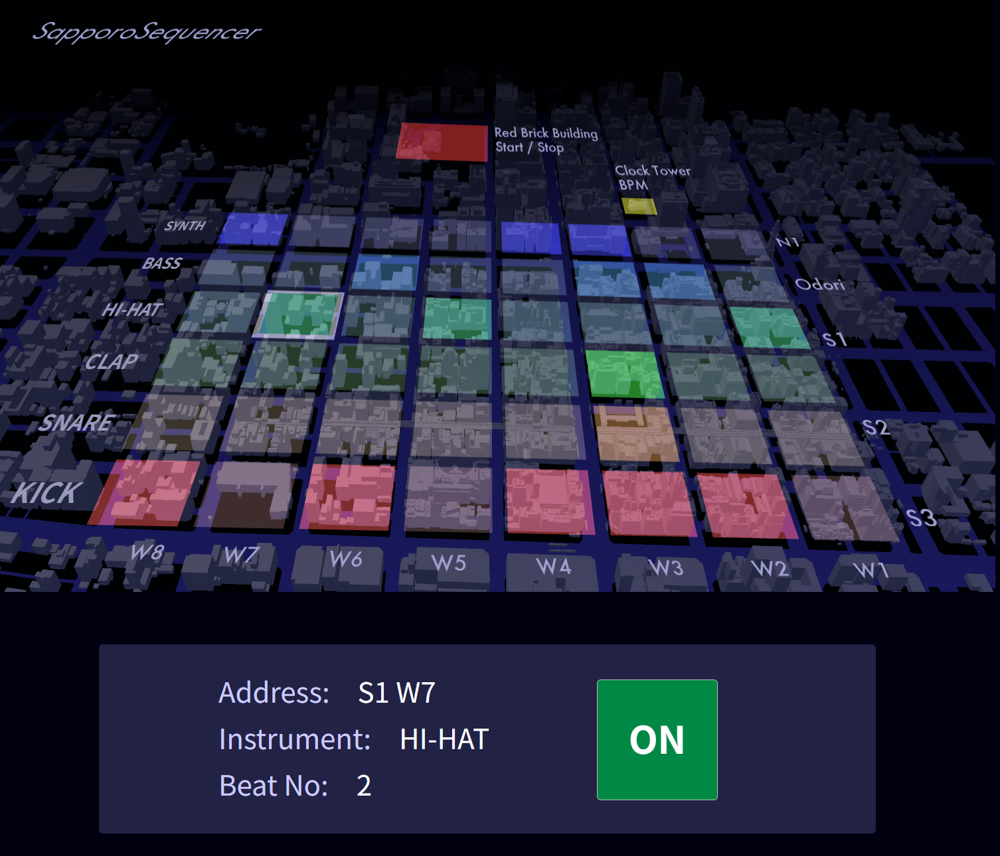

# SapporoSequencer

## Description

札幌の街全体をシーケンサーのユーザインタフェースにするスマホ用Webアプリです。  
グルーブボックスのようにリズムパターンを入力できますが、それには実際に札幌の街を歩き回ってカーソルを動かす必要があります。  
北は札幌時計台から南はすすきのまで、東はさっぽろテレビ塔から西は８丁目までまで、札幌中心街の範囲をカバーしています。

## Website

[https://aikelab.net/sapporosequencer](https://aikelab.net/sapporosequencer)

## Features

- 札幌市街地の地図をシーケンサーのUIに使用
- 位置情報を使ってカーソルを移動
- BPM設定
- 8step x 6track
- 音源は、キック、スネア、クラップ、ハイハット、ベース、シンセ

## Credit

SapporoSequencer program is licensed under MIT License.  
Contact: X @aike1000
